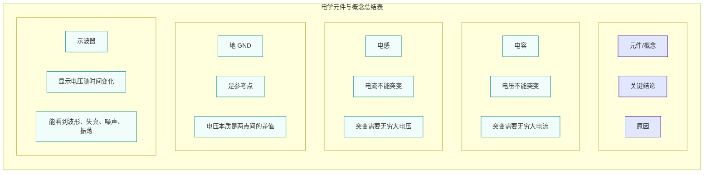

## Hi there 👋
这是我的学习笔记
this is my study note

# 模拟电路
## Part 1  基础认知
### 

```mermaid
flowchart TB
    classDef outer stroke:indigo,fill:#eef2ff
    classDef header stroke:indigo,fill:#e0e7ff
    classDef cell stroke:teal,fill:#f0fdfa

    subgraph Table["电学元件与概念总结表"]
    direction TB

        subgraph HeaderRow[" "]
            direction LR
            H1["元件/概念"]:::header
            H2["关键结论"]:::header
            H3["原因"]:::header
        end

        subgraph Row2[" "]
            direction LR
            C1["电容"]:::cell
            C2["电压不能突变"]:::cell
            C3["突变需要无穷大电流"]:::cell
        end

        subgraph Row3[" "]
            direction LR
            D1["电感"]:::cell
            D2["电流不能突变"]:::cell
            D3["突变需要无穷大电压"]:::cell
        end

        subgraph Row4[" "]
            direction LR
            E1["地 GND"]:::cell
            E2["是参考点"]:::cell
            E3["电压本质是两点间的差值"]:::cell
        end

        subgraph Row5[" "]
            direction LR
            F1["示波器"]:::cell
            F2["显示电压随时间变化"]:::cell
            F3["能看到波形、失真、噪声、振荡"]:::cell
        end
    end
```
最核心的两句话是：电容怕“电压突变”，电感怕“电流突变”。

## part 2 数学基础
### 
