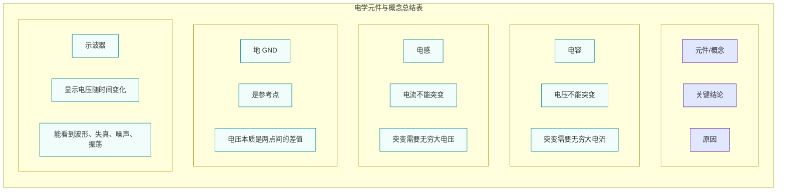

## Hi there 👋
这是我的学习笔记
this is my study note

# 模拟电路
## Part 1  基础认知
### 


最核心的两句话是：电容怕“电压突变”，电感怕“电流突变”。

## part 2 数学基础
### 

```mermaid
flowchart TB
    subgraph 外部层[" "]
        A[上位机 / 第三方系统]
    end

    A <-->|串口| B[串口通信层<br/>帧头校验  指令解析  路由分发  状态反馈]

    subgraph 逻辑层["逻辑层"]
        direction LR
        C[塔台控制模块<br/>俯仰轴转动<br/>航向轴转动<br/>到位状态反馈]
        D[光电载荷模块<br/>IR/TV双光切换<br/>变倍/聚焦控制<br/>黑热/白热/画中画<br/>2KM景深模拟]
        E[目标管理模块<br/>行人/车辆/无人机生成<br/>运动模型驱动<br/>激光干扰暂停<br/>坐标实时更新]
        F[识别跟踪模块<br/>视锥体检测<br/>自动锁定跟踪<br/>方位/俯仰计算<br/>丢失判定]
        
        C <-->|自动跟踪角度| F
        D <-->|目标坐标| E
        C <--> D
        D <--> E
        E <--> F
    end

    B <-->|指令下发/状态上报| C
    B <-->|指令下发/状态上报| D
    B <-->|指令下发/状态上报| E
    B <-->|指令下发/状态上报| F

    G[场景管理模块<br/>沙漠/城镇/机场切换<br/>地面/空中视角<br/>预设航线加载(JSON)]
    H[激光功能模块<br/>激光测距（距离计算）<br/>激光干扰（目标暂停5s + 冷却）]
    I[配置管理模块<br/>SimConfig.json（网络/显示/塔台参数）<br/>Routes.json（航线数据）]

    C --> G
    D --> H
    E --> H
    I --> F

    subgraph 表现层["表现层（Unity渲染输出）"]
        J[主显示窗口<br/>主画面（TV/IR通道）<br/>十字准星 + 跟踪框叠加<br/>画面信息叠加（ZOOM/FOV/RANGE/AZ/EL）<br/>画中画（右下角 1/8，副通道）]
        K[底部状态栏<br/>俯仰/航向/变倍  跟踪状态  激光状态  串口/心跳]
        L[调试信息层（F1切换）<br/>FPS  串口帧统计  目标坐标  航线航点]
    end

    H --> J
    G --> J
    J --> K

    subgraph 数据层["数据层"]
        direction LR
        M[场景资源<br/>沙漠地形  城镇建筑  机场跑道<br/>行人模型  车辆模型  无人机模型]
        N[配置文件<br/>SimConfig.json  Routes.json]
        O[日志文件<br/>Logs/运行日志  错误日志]
    end

    J --> M
    J --> N
    J --> O

    style A fill:#fff3e0,stroke:#e65100,stroke-width:2px
    style B fill:#e8f5e9,stroke:#2e7d32,stroke-width:2px
    style C fill:#e3f2fd,stroke:#1565c0,stroke-width:1.5px
    style D fill:#e3f2fd,stroke:#1565c0,stroke-width:1.5px
    style E fill:#e3f2fd,stroke:#1565c0,stroke-width:1.5px
    style F fill:#e3f2fd,stroke:#1565c0,stroke-width:1.5px
    style G fill:#f3e5f5,stroke:#6a1b9a,stroke-width:1.5px
    style H fill:#fce4ec,stroke:#c62828,stroke-width:1.5px
    style I fill:#fff8e1,stroke:#f57f17,stroke-width:1.5px
    style J fill:#e0f7fa,stroke:#00838f,stroke-width:1.5px
    style K fill:#eceff1,stroke:#546e7a,stroke-width:1.5px
    style L fill:#fafafa,stroke:#9e9e9e,stroke-width:1.5px
    style M fill:#e8eaf6,stroke:#3949ab,stroke-width:1.5px
    style N fill:#e8eaf6,stroke:#3949ab,stroke-width:1.5px
    style O fill:#e8eaf6,stroke:#3949ab,stroke-width:1.5px
    ```
